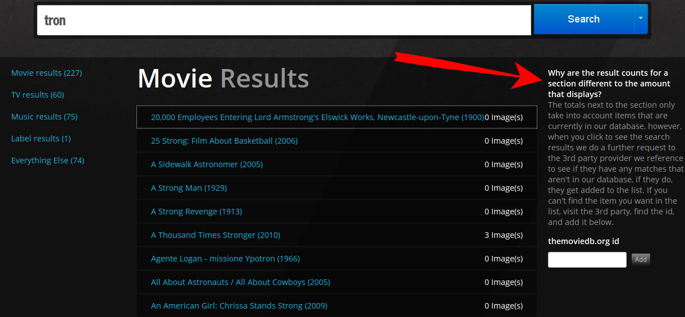

# __HOW FANART.TV WORKS__

Understanding how Fanart.tv works can be very confusuing, but I hope this guide will make a little easier.

__There are a couple of key points to remember that will make this easier.__

- Fanart.tv __DOES NOT__ keep a database of TV-Shows Movies or Music.
- Fanart.tv __DOES__ source this information from other Databases.
- Fanart.tv __DOES__ keeps it’s own Database of Images and Pages on our site.

__The databases we use to source our information is as follows.__

- Movies are sourced from [TheMovieDB.org](https://www.themoviedb.org/){target= blank}
- TV-Shows are sourced from [TheTVDB.com](https://thetvdb.com/){target= blank}
- Music is sourced from [Musicbrainz.org](https://musicbrainz.org/){target= blank}
{target= blank}

So for instance, if you would search for the movie Tron on our site, we then search through our own Database as well as all of these databases listed above and return every result, categorized by type.

What does this all mean?

There will be times when you will find a problem on our site such as the following:

Title not found
Incorrect Title
no-english-title-set
Duplicate Entries
All of these issues can be traced back to their respective Databases and need to be fixed there. These sites are constantly updating their own information and that doesn’t get propagated to our own site unless we make a new request for that information. (ie.. refresh our info) Once those changes are made at those sites, you can request in our Housekeeping section of the forums to have that Series/Movie/Artist page refreshed, and then this site should reflect those changes.

Each of those sites we source from are community driven sites like our own and rely on users like you to help maintain those databases accurately. We encourage you to create accounts on those sites to be able to make changes when you see something that isn’t right. Of course we also encourage you to read and follow the rules on each site respectively.

TIPS ON EDITING.
MUSICBRAINZ.ORG
We have a tutorial here on how to Add Album to the Database.This can help if you can’t find the album already listed on our site.

THEMOVIEDB.ORG:
For the “no-english-title-set” problem. This usually means the movie was never released in the U.S. and as such needs an English translation for the title to show properly on our site. The proper way to fix this is to first check if an English title has been added already and we just need to refresh it on our site. (see above)

If not, the next step is to check IMDB for an English alias (AKA).  You need to look down the page and find the heading named Details. Under that heading you will see a line named Also Known As. Click the see more link and check for an English or World-wide title. This is what you will enter on TheMovieDB by editing the Alternative Titles Section.

The MovieDB Contribution Bible

THETVDB.COM
For the “no-english-title-set” problem, the process is actually similar as with movies. Once you’ve opened up the show’s page, look for the “Toolbox” on the right side of the page. There you will find a button for “Edit Translations”. Just add the proper information for the English Title and Plot as per thetvdb rules, and then we can update it on our side. One important point to be aware of is sometimes the series will be locked because of rampant vandalism in the past. So to have a title changed or added in a different language you may need to make a request.

The TVDB Contribution Bible

Notes:
It can take a day or two once you make an edit on one of the DB sites for it to propagate and be available to their API. It’s best to give it at least a day before requesting a refresh. (2 days is better) That way we won’t have to do it twice.
When the new site is finished, it will be available in multiple languages. So if you are trying to add German series/movie on the German site, you should see the German title by default and there will be no need to have a translated English title. Until then, we only have the English site which means the “no-english-title-set” is actually correct unless someone adds one.
Which Entry to use when there are Duplicate Entries?
Obtain the correct show/movie ID by visiting thetvdb or themoviedb. Each site uses a numerical ID# to identify an entry, and with this number you can determine which entry on our site to use.

So you did a search for “A Million Little Things” on our site and you find duplicate entries. The first thing to note is the ID for each entry. This can be found in most browsers by just hovering over each link.

You can also just go to each entry and look at your address bar to find the ID if the hovering didn’t work.

Now that you know both numbers, you can head to thetvdb.org to find out which one to use. So if I searched for “A Million Little Things” on thetvdb.org, I can find this number right in the results page.

This number is also displayed inside the show’s entry.

Now that you know which entry to upload to, the last thing to do is to please notify a moderator or an admin so it can be fixed in our DB.

Notes:
For various reasons, ID numbers get changed quite frequently. (Shows merged, duplicate movies under different names, etc..)
As we can’t control when other sites change ID numbers in their databases, there will be times when we will have image collisions once duplicate entries are merged
All things being equal, the first upload by date will take precedence. If the newer image is a clear upgrade in quality, it will be selected instead.
Moderator decisions are final.